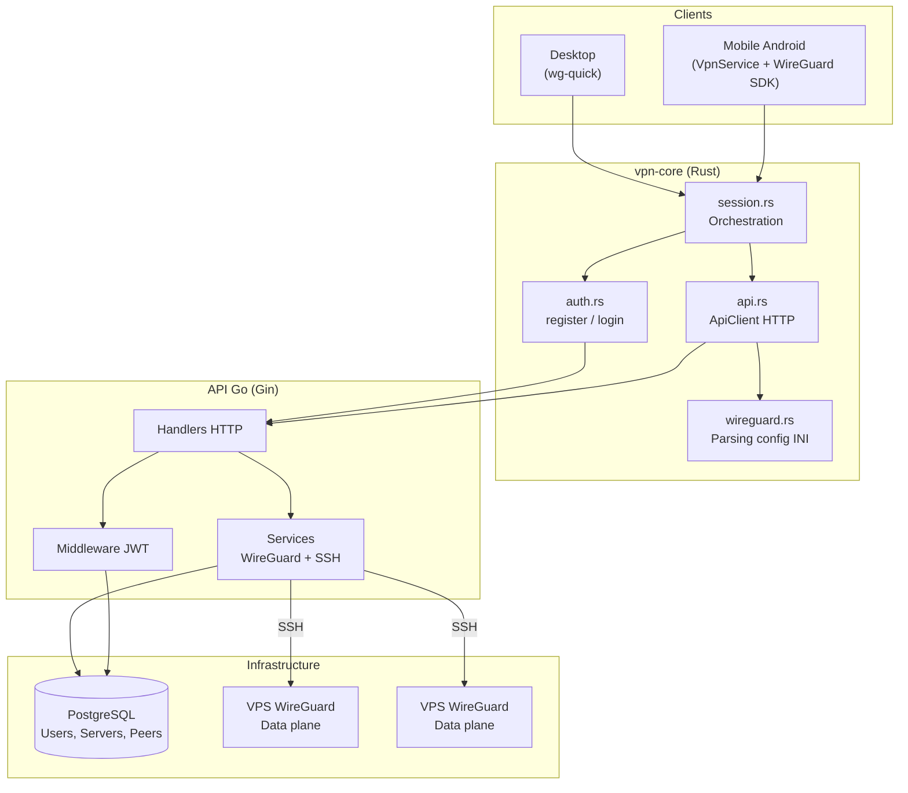
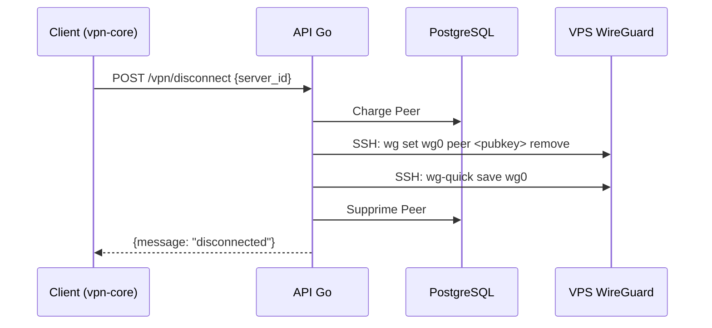

# FIRE-VPN

Service VPN base sur WireGuard avec architecture client-serveur. Les utilisateurs s'authentifient, decouvrent les serveurs disponibles et s'y connectent dynamiquement. Le systeme gere automatiquement le cycle de vie des peers WireGuard sur les VPS distants via SSH.

## Architecture



**API Go** : plan de controle — authentification, gestion des utilisateurs, allocation des peers, execution SSH sur les VPS.

**vpn-core (Rust)** : bibliotheque client partagee — communication avec l'API, parsing des configs WireGuard, orchestration de session.

**WireGuard sur VPS** : plan de donnees — tunneling VPN.

## Schema de la base de donnees


## Stack technique

| Composant | Technologies |
|-----------|-------------|
| API Backend | Go 1.24, Gin, GORM, PostgreSQL, golang-jwt, curve25519, SSH |
| Lib Client | Rust 2021, reqwest, serde, thiserror |
| VPN | WireGuard (kernel Linux sur VPS) |
| Base de donnees | PostgreSQL 16 (Docker) |

## Structure du projet

```
FIRE-VPN/
├── docker/
│   └── docker-compose.yml  # PostgreSQL 16
└── workspace/
    ├── api-go/             # API backend Go
    │   ├── main.go         # Point d'entree
    │   ├── config/         # Chargement variables d'environnement
    │   ├── models/         # User, VPNServer, Peer
    │   ├── db/             # Operations CRUD (GORM)
    │   ├── handlers/       # Handlers HTTP
    │   ├── middleware/      # Authentification JWT
    │   ├── services/       # Generation cles WireGuard, SSH
    │   ├── routes/         # Definition des routes
    │   └── utils/          # Helpers reponses JSON
    │
    └── vpn-core/           # Bibliotheque client Rust
        └── src/
            ├── auth.rs     # register(), login()
            ├── api.rs      # ApiClient HTTP
            ├── wireguard.rs# Parsing config WireGuard (INI)
            └── session.rs  # Orchestration session
```

## Pre-requis

- **Go** 1.24+
- **Rust** (edition 2021)
- **Docker** et **Docker Compose**
- **VPS** avec WireGuard installe et accessible via SSH
- Cle SSH configuree pour l'acces aux VPS

## Installation

### Base de donnees (Docker)

```bash
cd docker
docker compose up -d
```

PostgreSQL 16 demarre sur le port `5432`. La base, l'utilisateur et le mot de passe sont configures via les variables d'environnement (voir section Configuration). Les valeurs par defaut correspondent au `.env` de l'API.

### API Go

```bash
cd workspace/api-go
cp .env .env.local    # modifier les valeurs
go mod tidy
go run main.go
```

Les tables sont creees automatiquement au demarrage via GORM AutoMigrate.

### Bibliotheque client Rust

```bash
cd workspace/vpn-core
cargo build --lib
cargo test
```

Le crate produit trois types de sortie :
- `lib` — usage Rust natif (desktop)
- `staticlib` — lib statique C (mobile)
- `cdylib` — lib dynamique C (FFI mobile)

## Configuration

Variables d'environnement (fichier `.env` dans `workspace/api-go/`) :

| Variable | Description | Defaut |
|----------|-------------|--------|
| `API_PORT` | Port de l'API | `8080` |
| `DB_HOST` | Hote PostgreSQL | `localhost` |
| `DB_PORT` | Port PostgreSQL | `5432` |
| `DB_USER` | Utilisateur DB | `vpn_admin` |
| `DB_PASSWORD` | Mot de passe DB | - |
| `DB_NAME` | Nom de la base | `vpn_db` |
| `DB_SSLMODE` | Mode SSL PostgreSQL | `disable` |
| `JWT_SECRET` | Secret global JWT | - |
| `SSH_KEY_PATH` | Chemin cle SSH pour VPS | `~/.ssh/id_rsa` |

## Endpoints API

### Public

```
POST /auth/register    {"username", "email", "password"}
POST /auth/login       {"email", "password"}
```

### Protege (Authorization: Bearer <token>)

```
GET  /vpn/servers      Liste des serveurs actifs
POST /vpn/connect      {"server_id": 1}  →  config WireGuard
POST /vpn/disconnect   {"server_id": 1}
GET  /vpn/status       Connexions actives de l'utilisateur
```

## Flux de connexion


## Flux de deconnexion



## Securite


- Requetes parametrees via GORM (protection injection SQL)
- Cles privees jamais exposees dans les reponses API (sauf config client a la connexion)

## Documentation detaillee

- [API Go](workspace/api-go/README.md) — endpoints, exemples curl, flux detailles
- [vpn-core](workspace/vpn-core/README.md) — modules Rust, exemples de code, flux desktop/mobile

## Licence

Projet prive.
